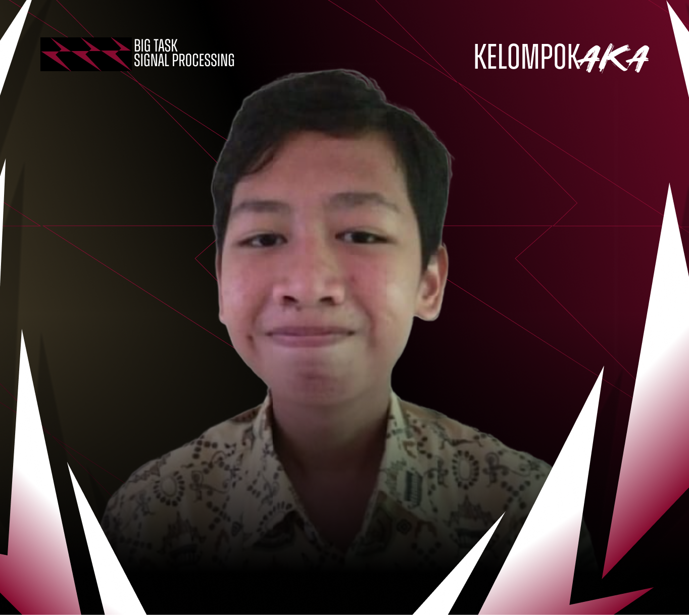
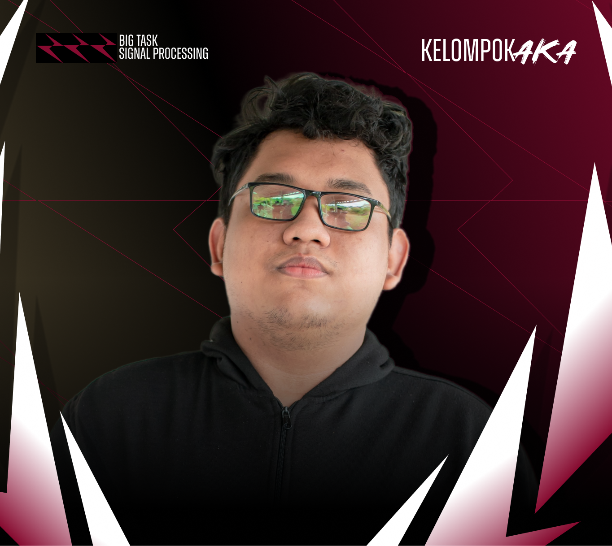
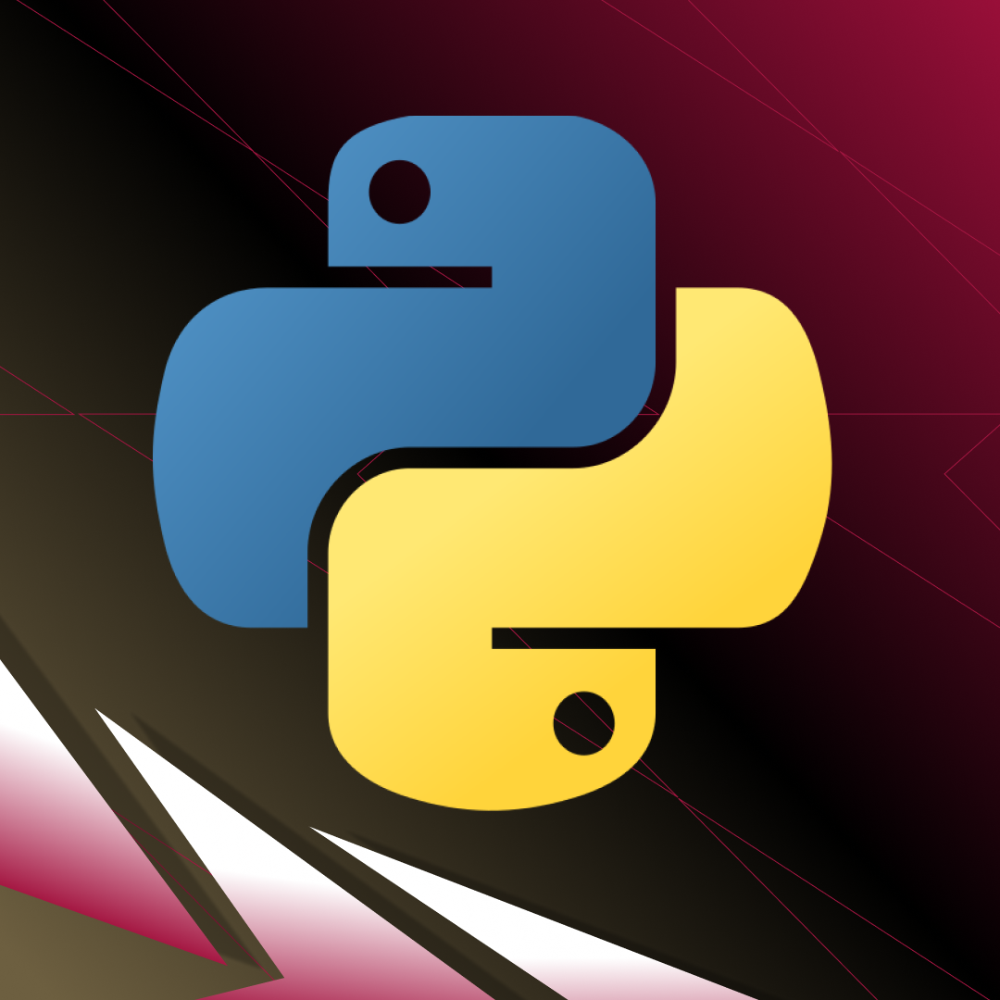
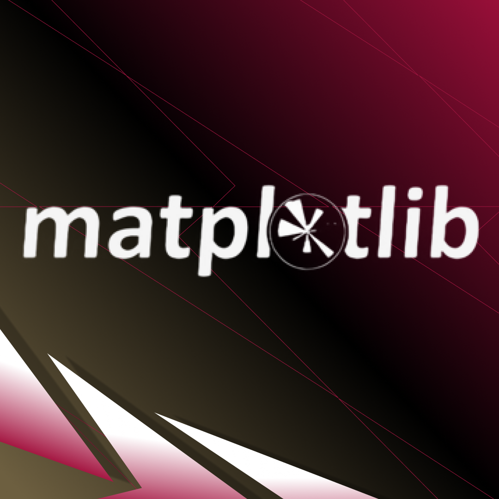
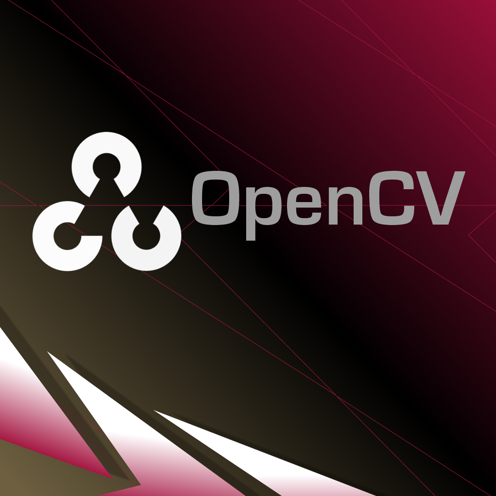

<div align="center">

<h1> RPPG Final Project </h1>

[](#)
[](#)
</div>

##  **Table Of Contents**
[Introduction]()

[Member Of Team]()

[Role & Position Member Of Team]()

[Technology Application]()

[Installation Steps]()

[Weekly Logbook]()

[Discussion Analysis]()

[Presentation Video]()

##  **Introduction**
A final project that creates a program that accepts video input from a webcam and processes the video in real time and displays respiration signals and RPPG signals using matplotlib and/or cv2.

##  **Member Of Team**
| [<br /><sub><b>M. Atha Akbar</b></sub>](https://github.com/AthaAkbar123)<br /> 121140123 <br /> | [<br /><sub><b>Kevin Simorangkir</b></sub>](https://github.com/kevinsimorangkir21)<br />121140150 <br /> | [<br /><sub><b>Alfath</b></sub>](https://github.com/Alfath12311) <br/> 121140157 <br /> |
|--|--|--|

##  **ID & Position Member Of Team**
<div align="left">

| Name | ID Student | Class | Major
| :---: | :---: | :---: | :---: |
| **M. Atha Akbar** | 121140123 | R | Informatics Engineering |
| **Kevin Simorangkir** | 121140150 | R | Informatics Engineering |
| **Alfath Elnandra** | 121140157 | R | Informatics Engineering |

</div>

##  **Technology Application**
<div align="left">

| Technology | Name | Description |
| :---: | :---: | :---: |
|  | **Python** | Python is an interpreted, high-level and general-purpose programming language. Python's design philosophy emphasizes code readability with its notable use of significant whitespace. |
|  | **Matplotlib** | Matplotlib is a plotting library for the Python programming language and its numerical mathematics extension NumPy. It provides an object-oriented API for embedding plots into applications using general-purpose GUI toolkits like Tkinter, wxPython, Qt, or GTK. |
|  | **OpenCV** | OpenCV (Open Source Computer Vision Library) is an open-source computer vision and machine learning software library. OpenCV was built to provide a common infrastructure for computer vision applications and to accelerate the use of machine perception in commercial products. |

</div>

##  **Installation Steps**
###  **Preparation of Needs**
Some of the preparations needed to carry out this research project are as follows:

<li> Install python software/code first </li>

```bash
https://www.python.org/downloads/
```

<li> After installing, first check whether Python has been installed properly using the following command: </li>

```bash
python --version
```

<li> Once the python version appears, please open a text editor that supports it such as Visual Studio Code and the web-based Google Collab. Here are the links to use both (please download and install) :</li>

```bash
[Software VISUAL STUDIO CODE](https://code.visualstudio.com/)
```

```bash
[Software GOOGLE COLLAB](https://colab.research.google.com/)
```

<!-- <li> To install Pygame, please use the following command: </li>

```bash
pip install pygame
```

<li> To install MediaPipe, please use the following command: </li>

```bash
pip install mediapipe
```

###  **Program Running Stage**
<li> Open a terminal / something like GitBash etc. Please clone this Repository by following the following command and copy it in your terminal: </li>

```bash
https://github.com/Ardoni121140141/Pong-With-Hand-Tracking.git
```

<li>Please change the directory to point to the clone folder with the following command:</li>

```bash
cd Pong-With-Hand-Tracking
```

<li> After that, please run the following command to run the program:</li>

```bash
python main.py
```

##  **Weekly Logbook**
| Week | Task | Person | Status |
| :---: | :---: | :---: | :---: |
| Week 1 | - Installing OpenCV, Pygame and Mediapipe modules <br> - Save the requirements.txt file for the purpose of installing dependencies. <br> - Creating basic code to detect hand gestures using MediaPipe | Ardoni Yeriko & Kevin Simorangkir | Done | -->