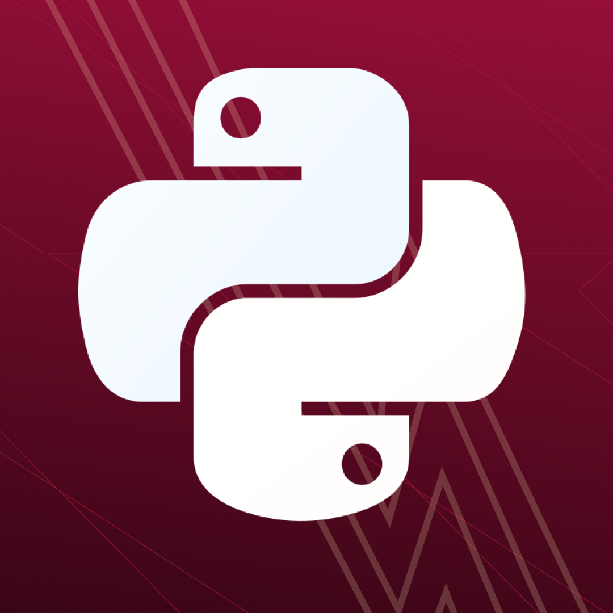
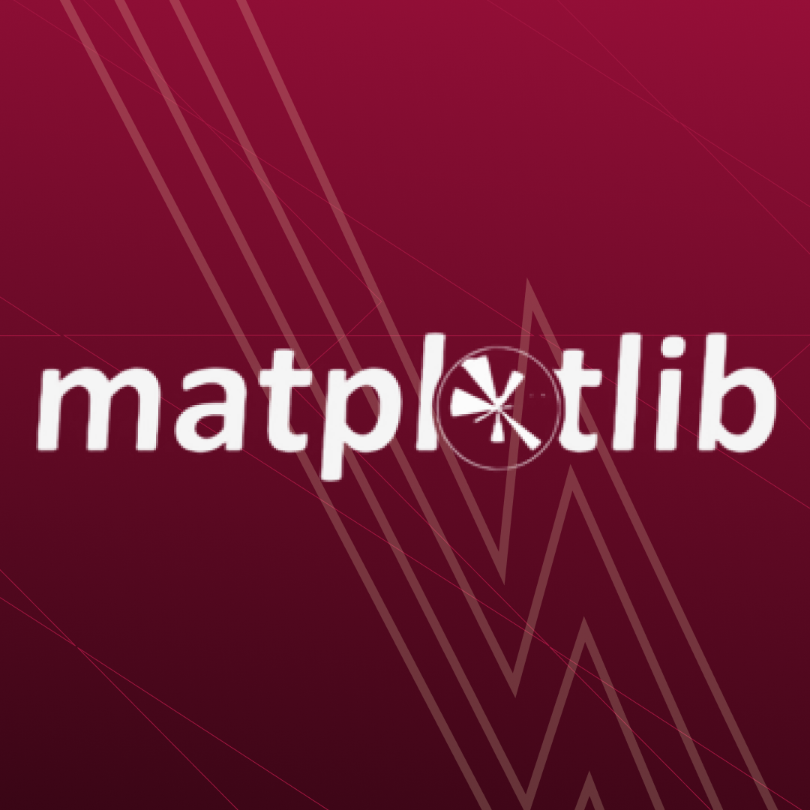
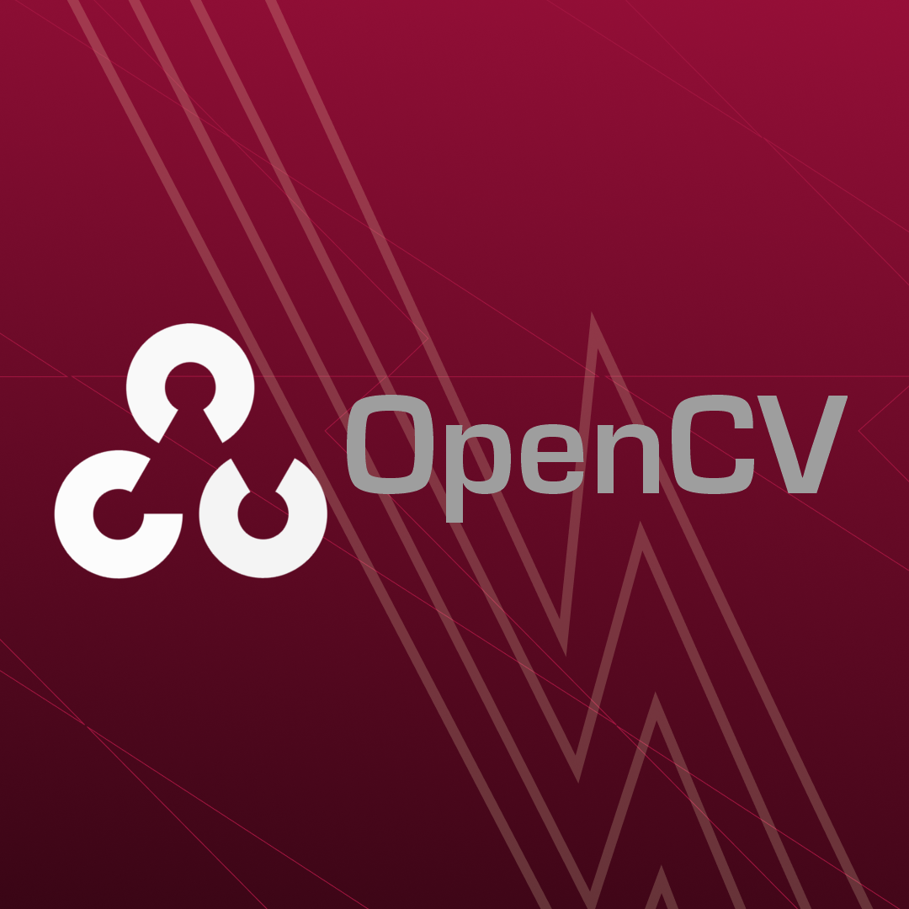

<div align="center">

<h1> RPPG Final Project </h1>

[](#)
[](#)
</div>

##  **Table Of Contents**
[Description]()

[Member Of Team](#member-of-team)

[ID & Position Member Of Team](#id--position-member-of-team)

[Technology Application](#technology-application)

[Installation Steps]()

[Weekly Logbook]()

[Discussion Analysis]()

[Presentation Video]()

##  **Description**
A final project in the assignment in the Digital Signal Processing (IF3024) with Martin Clinton Tosima Manullang, S.T., M.T. as a lecturer, course that asks to create a program to receive video input from a camera/webcam then process the video in real time and display the respiration signal and RPPG signal using several libraries needed in this assignment such as matplotlib, cv2, and others.

##  **Member Of Team**
| [<br /><sub><b>M. Atha Akbar</b></sub>](https://github.com/AthaAkbar123)<br /> 121140123 <br /> | [<br /><sub><b>Kevin Simorangkir</b></sub>](https://github.com/kevinsimorangkir21)<br />121140150 <br /> | [<br /><sub><b>Alfath Elnandra</b></sub>](https://github.com/Alfath12311) <br/> 121140175 <br /> |
|--|--|--|

##  **ID & Position Member Of Team**
<div align="left">

The following is the AKA Group consisting of 3 members following the provisions for completing the assigned tasks:

| Name | ID Student | Class | Major | Force |
| :---: | :---: | :---: | :---: | :---: |
| **Muhammad Atha Akbar** | 121140123 | R | Informatics Engineering | 2021 |
| **Kevin Simorangkir** | 121140150 | R | Informatics Engineering | 2021 |
| **Alfath Elnandra** | 121140175 | R | Informatics Engineering | 2021 |

</div>

##  **Technology Application**
<div align="left">

Some of the technologies used in this assignment and based on the assignment provisions given by the supervisor are:

| Technology | Name | Description |
| :---: | :---: | :---: |
|  | **Python** | Python is an interpreted high-level general-purpose programming language. Python's design philosophy emphasizes code readability with its notable use of significant indentation. Its language constructs and object-oriented approach aim to help programmers write clear, logical code for small and large-scale projects. |
|  | **Matplotlib** | Matplotlib is a plotting library for the Python programming language and its numerical mathematics extension NumPy. It provides an object-oriented API for embedding plots into applications using general-purpose GUI toolkits like Tkinter, wxPython, Qt, or GTK. |
|  | **OpenCV** | OpenCV / Open Source Computer Vision Library is an open-source computer vision and machine learning software library. OpenCV was built to provide a common infrastructure for computer vision applications and to accelerate the use of machine perception in commercial products. |
|  | **NumPy** | NumPy / Numerical Python is a very popular Python library used for scientific and numerical computing. NumPy provides a main data structure in the form of a multidimensional array called ndarray, as well as various functions to perform mathematical, statistical, and data manipulation operations on the array. |
|  | **SciPy** | SciPy / Scientific Python is a Python library designed for scientific and technical computing. SciPy builds on NumPy and extends its functionality by providing additional tools for signal processing, optimization, statistics, linear algebra, interpolation, and more. |

</div>

##  **Usage Stage**

The Usage Stage in this project is divided into 2 (two) stages, namely the Installation Stage and the Usage Stage. The following is an explanation of the two stages, namely:

###  **Installation Stage**
Several stages of installation preparation in carrying out this research project are as follows:

<li> First install a software/application/tool ​​to run a Python program code. If you have not installed it, please visit the following link: </li>

```bash
https://www.python.org/downloads/
```

<li> The next step, after installing, please check the installed Python version by typing the following command in Command Prompt/Power Shell/GitBash: </li>

```bash
python --version
```

<li> The next step is running the Python program code. To run the program code, please use a text editor such as Visual Studio Code (VS Code) / Google Collab / Online Python Compiler / Replit. Here are links to use some text editor suggestions:</li>

```bash
https://code.visualstudio.com/
```

```bash
https://colab.research.google.com/
```

```bash
https://www.onlinegdb.com/online_python_compiler
```

```bash
https://replit.com/
```

<li> The next step is to run the program. However, you need to install some libraries first with the following command:

```bash
pip install opencv-python
```

```bash
pip install mediapipe
```

```bash
pip install numpy
```

```bash
pip install matplotlib
```

```bash
pip install scipy
```
<li>Or you can directly install the library with a single command at the conda prompt:</li>

```bash
conda env create -f environment.yml
```

<li>After moving the environment file to:</li>

```bash
C:/Users/user/environment.yml
```


###  **Program Running Stage**
<li> Then open a terminal such as Command Prompt/Power Shell/Git Bash/other. Next, clone the RPPG Final Project repository by following the following command and copy it to your terminal: </li>

```bash
git clone https://github.com/kevinsimorangkir21/RPPG-Final-Project.git
```

<li>Please change the directory to point to the previous clone folder with the following command:</li>

```bash
cd PRPPG-Final-Project
```

<li> After that, the next step is to run a program with the following command:</li>

```bash
python main.py
```

##  **Weekly Logbook**
| Week | Description | Person | Status |
| :---: | :---: | :---: | :---: |
| **Week 1** | - Install OpenCV, NumPY, SciPY, and Matplotlib modules <br> - Save a requirements.txt file for the purpose of installing dependencies. <br> - Create a basic code to detect facial movements so that they can be detected into a signal. | **Kevin Simorangkir** | **Done** |
| **Week 2** | - Create a basic code is vipro.py to detect facial movements so that they can be detected into a signal. <br> - Create a basic sigproc.py code to process the signal obtained from the facial movements. <br> - Create a basic code is main.py to run the program. | **Kevin Simorangkir** | **Done** |
| **Week 3** | - Implementation of video logic to detect a user's face <br> - Finalization of the program code <br> - Finalization of a report that is created and addressed with an explanation of a program code. | **M. Atha Akbar, Kevin Simorangkir, Alfath Elnandra** | **Done** |

##  **Discussion Analysis**
The following explains the results of the analysis of the program code that has been created and refined well and structured. Here are the results:

| **Category** | **Details** |
|---|---|
| **Accuracy** | The system uses the OpenCV library with the Haar Cascade method to detect faces in real-time. It has a fairly high success rate but struggles in poor lighting or extreme face angles. |
| **Extraction Process**| RPPG and respiration waveforms were successfully generated every 10 seconds with good stability under normal lighting conditions. **Signal Filtering**: The raw data from rPPG and respiration extraction were filtered using a bandpass filter to improve waveform accuracy and reduce artifacts. |
| **System Performance**| The data update interval is 10 seconds.|
| **Challenges** | - Face detection is less than optimal in low light conditions.<br> - Faces with masks or other accessories reduce the accuracy of detection results.|

##  **Presentation Video**
The following is a link to the presentation video of the RPPG Final Project:

<a href="https://youtu.be/36a1C47i-T4?si=-zljxbxT5o1GLg-g">
  
</a>
